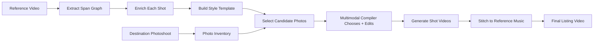

# Fal AI Video Description Agent

A Python application that uses Fal AI's video-understanding model and a local AutoHDR style-transfer scaffold for real estate photo-to-video experiments.

## Features

- **Video Input Support**: Analyze videos from URLs or local files
- **Custom Prompts**: Use custom prompts to get specific information about videos
- **Error Handling**: Comprehensive error handling and validation
- **Command Line Interface**: Easy-to-use CLI with argparse
- **Multiple Video Formats**: Supports MP4, AVI, MOV, MKV, WebM, FLV
- **AutoHDR Style Pipeline**: Maps a destination photoshoot onto the reference MP4 style and emits a render plan with selected assets, variant requests, prompts, and quality gates.

## Setup

### 1. Install Dependencies

```bash
pip install -r requirements.txt
```

### 2. Set Up API Key

Get your API key from [Fal AI](https://fal.ai/) and set it as an environment variable:

```bash
export FAL_KEY="your-api-key-here"
```

Or add it to your shell profile (~/.bashrc, ~/.zshrc, etc.):

```bash
echo 'export FAL_KEY="your-api-key-here"' >> ~/.bashrc
source ~/.bashrc
```

## Usage

### AutoHDR Hackathon Demo UI

Run the local demo app:

```bash
uvicorn autohdr_demo.app:app --host 127.0.0.1 --port 8000 --reload
```

Open `http://127.0.0.1:8000`. The page accepts a reference video and a photoshoot image set, or lets you select an existing R2 reference video instead of uploading one again. Fresh reference uploads are written to the configured R2 Worker, then the verified AutoHDR backend pipeline runs with the demo quality profile:

- full-video span graph extraction
- per-shot span enrichment
- multimodal photo selection
- Fal image/video generation
- final assembly with the reference audio

The UI also queries R2 for existing reference videos and final video uploads. Completed demo finals are uploaded to the `AUTOHDR_FINAL_VIDEO_PREFIX` prefix, defaulting to `autohdr-output`. The R2 Worker in `r2-public/` must be deployed so `?list=1` bucket listing is available. Runtime files are written under `demo_runs/`.

#### Demo Quality Profile

The UI generates a pipeline command equivalent to:

```bash
python -B -m autohdr_pipeline.pipeline \
  --reference "$LOCAL_REFERENCE_PATH" \
  --reference-url "$PUBLIC_REFERENCE_URL" \
  --photoshoot "$LOCAL_PHOTOSHOOT_DIR" \
  --output-dir "$RUN_OUTPUT_DIR" \
  --ai-style \
  --shot-style-fragments \
  --video-understanding-endpoint openrouter/router/video \
  --video-understanding-model google/gemini-3.1-pro-preview \
  --video-understanding-max-tokens 96000 \
  --video-understanding-temperature 0.05 \
  --shot-style-fragments-max-tokens 16000 \
  --shot-style-fragments-parallelism 0 \
  --multimodal-compile \
  --multimodal-model google/gemini-3.1-pro-preview \
  --multimodal-max-candidates 0 \
  --multimodal-parallelism 0 \
  --r2-base-url "$AUTOHDR_R2_BASE_URL" \
  --preview \
  --preview-output "$RUN_OUTPUT_DIR/preview.mp4" \
  --preview-width 1280 \
  --preview-height 720 \
  --preview-fps 24 \
  --generate \
  --generation-resolution 1080p \
  --generation-video-model bytedance/seedance-2.0/image-to-video \
  --generation-parallelism 0
```

`0` means "use all available work" for parallelism. For `--multimodal-max-candidates`, `0` means "send every candidate in the curated compiler pool." The curated pool is currently the top 20 locally ranked photos per shot, which keeps the prompt focused while avoiding the old double-filter where the model saw only 6 of 8 candidates.

The final assembler honors `--generation-resolution`; 1080p generations are assembled at 1920x1080 with CRF 17 H.264 video and 192 kbps AAC audio. The preview remains a fast local animatic, not the final quality target.

Quality knobs can be overridden with environment variables:

| Variable | Default | Purpose |
| --- | --- | --- |
| `AUTOHDR_DEMO_VIDEO_UNDERSTANDING_MODEL` | `google/gemini-3.1-pro-preview` | Full-video and per-shot video understanding model. |
| `AUTOHDR_DEMO_MULTIMODAL_MODEL` | `google/gemini-3.1-pro-preview` | Image-aware compiler model. |
| `AUTOHDR_DEMO_MULTIMODAL_MAX_CANDIDATES` | `0` | Candidate images per shot; `0` uses the full curated pool. |
| `AUTOHDR_DEMO_GENERATION_VIDEO_MODEL` | `bytedance/seedance-2.0/image-to-video` | Final per-shot video generation endpoint. |
| `AUTOHDR_DEMO_GENERATION_RESOLUTION` | `1080p` | Final generation and assembly resolution. |

#### Demo Flow



## Agent Orchestration

The pipeline is organized as a sequence of agents that hand structured artifacts to the next agent. The schemas are intentionally JSON-compatible for UI visualization and debugging, but the payloads include rich text fields because the main interpreters are humans and models.

### 1. Demo Run Steward

Producer: `autohdr_demo.app`

The UI creates a run folder under `demo_runs/<run_id>/`, stores uploaded photos locally, and resolves the reference video into two forms:

- local path for `ffprobe`, cut detection, preview rendering, and audio assembly
- public R2 URL for Fal/OpenRouter video understanding

If the user selects a bucket reference, the steward downloads it locally and skips the reference re-upload. If the user uploads a new reference, the steward uploads it to `AUTOHDR_DEMO_R2_PREFIX`.

### 2. Bucket Catalog Agent

Producer: `r2-public/src/index.js`

The R2 Worker supports object read, write, delete, and list. The UI calls `/api/bucket/videos`, which uses the Worker list API to group bucket videos into:

- reference videos, such as root MP4 uploads or `autohdr-demo/<run_id>/reference.mp4`
- final videos, usually under `autohdr-output/`

### 3. Timeline Analyzer

Producer: `autohdr_pipeline.utils.probe_video`

This agent probes deterministic video facts with `ffprobe` and derives cut candidates with `ffmpeg` scene detection. These cut candidates are passed into the full-video prompt so the video-understanding model does not collapse a rich 96-second reference into a coarse summary.

### 4. Full-Video Span Graph Agent

Producer: `autohdr_pipeline.pipeline.fetch_fal_span_graph`

This agent sends the complete reference video plus deterministic metadata to `openrouter/router/video` with Gemini 3.1 Pro Preview. It asks for a graph of overlapping spans:

- whole-video style
- music phrases
- property sections
- shot groups
- shot spans
- transitions
- micro-events

The prompt explicitly asks for weather changes, staging changes, impossible angle transitions, match cuts, speed ramps, and music-synced state changes.

### 5. Shot Span Normalizer

Producer: `autohdr_pipeline.shot_spans.granular_shot_spans`

The model span graph is semantic, not trusted as a hard timeline. This normalizer reconciles model spans with deterministic cut candidates. If the model returns coarse shot spans, the normalizer expands them back to cut-level shot spans while preserving the semantic parent context.

### 6. Per-Shot Style Enrichment Agent

Producer: `autohdr_pipeline.segment_style_fragments.extract_shot_style_fragments`

This agent runs the second prompt only for shot spans. Each call sees the reference video plus the specific shot time range, parent span summaries, overlapping music/transition context, and full-video style summary. Its job is to recover details that the full-video pass often loses:

- transition mechanics
- shot-relative beat timing
- camera grammar
- prompt fragments
- creative events
- quality and safety notes

### 7. Style Template Builder

Producer: `autohdr_pipeline.ai_style_template.build_ai_style_template`

This agent compiles the span graph and shot fragments into a UI-friendly `StyleTemplate`. It creates one `shotSlot` per granular reference shot, rescales timestamps to deterministic duration, attaches overlapping music/transition/micro-event context, and preserves creative events as flexible objects instead of narrow enums.

### 8. Photoshoot Inventory Agent

Producer: `autohdr_pipeline.photo_inventory.analyze_photoshoot`

This agent treats the destination photoshoot as processable source material. It classifies each image with local visual heuristics:

- space type
- shot scale
- feature tags
- motion suitability
- geometry risk
- lighting potential
- variant potential

This is a local MVP classifier. The multimodal compiler later gets to inspect actual images and override it.

### 9. Deterministic Selection Compiler

Producer: `autohdr_pipeline.compiler.compile_render_plan`

This agent scores every destination asset against every style shot slot. It creates an initial render plan with selected assets, prompt drafts, quality checks, and a `multimodalCompilerRequest` containing the top 20 ranked candidate photos for each shot.

### 10. Multimodal Compiler Agent

Producer: `autohdr_pipeline.multimodal_compiler.run_multimodal_compile`

This is the main image-aware compiler. It uploads candidate images to R2, sends them to Gemini 3.1 Pro Preview, and asks the model to choose the best source image or request a processable variant. The compiler can:

- accept the local selection
- choose a different candidate
- request conservative edits
- request cinematic lighting
- request detail crops
- request creative reframes
- request first/last frame variants
- request weather or staging transforms
- request transition plates

It also prevents repeated raw reuse of the same image unless the new ingredient variant is meaningfully different.

### 11. Ingredient Variant Planner

Producer: `build_ingredient_request_queue`

The multimodal decisions are normalized into queued image-edit requests. `raw_passthrough` needs no edit. Other modes create an ingredient prompt with preservation constraints so the image editor can make the source photo better match the reference shot without inventing property facts.

### 12. Generation Steward

Producer: `autohdr_pipeline.generation.generate_and_assemble`

This agent runs image edits when needed, generates one video clip per shot with the configured Fal video model, downloads the clips, trims them to the reference shot durations, and assembles the final MP4 against the reference audio track. It can reuse valid local clips on resumed runs and ignores corrupt JSON sidecars instead of crashing.

### 13. Publisher

Producer: `autohdr_demo.app`

When the final MP4 exists, the demo app uploads it to the R2 final-output prefix and exposes both local run artifacts and public final URLs in the UI.

## Schemas and Artifacts

| Artifact | Schema | Producer | Main Consumer | Purpose |
| --- | --- | --- | --- | --- |
| `manifest.json` | `autohdr_demo_run.v1` | Demo run steward | UI | Run status, selected reference URL, local paths, progress, artifact links, and final bucket URL. |
| `fal_span_graph.raw.json` | provider response | Full-video span graph agent | Debugging | Raw Fal/OpenRouter response. |
| `fal_span_graph.parsed.json` | prompt-defined span graph | Full-video span graph agent | Style builder, span map UI | Parsed reference video graph with spans, timestamps, style, content, transitions, and creative events. |
| `fal_span_graph.validation.json` | `fal_span_graph_validation.v1` | Timeline analyzer | Debugging | Compares model duration/timestamps to deterministic ffprobe duration. |
| `shot_style_fragments.json` | `shot_style_fragments.v1` | Per-shot style enrichment agent | Style template builder | Rich per-shot readings from the second prompt. |
| `reference_style_template.ai.json` | `style_template.ai_span_graph.v1` | Style template builder | Selection compiler | Reference-derived shot slots, global style, span context, creative events, and transfer policy. |
| `reference_style_template.local.json` | local style template | Local fallback | Selection compiler | Static fallback style template when AI extraction is not used. |
| `photo_inventory.local.json` | `photo_inventory.local.v1` | Photoshoot inventory agent | Selection compiler | Destination photo assets and processability metadata. |
| `render_plan.ai.json` | `render_plan.local.v1` with AI style slots | Deterministic selection compiler | Multimodal compiler, preview | Initial shot-by-shot plan before image-aware overrides. |
| `render_plan.ai.multimodal.json` | `render_plan.multimodal_compiled.v1` | Multimodal compiler | Generation steward, UI | Final compiled render plan with selected assets, prompts, variants, and queued ingredient requests. |
| `multimodal_compiler_decisions.json` | `multimodal_compiler_decisions.v1` | Multimodal compiler | Debugging, UI review | Raw and applied model decisions for every shot. |
| `generation_manifest.json` | `generation_manifest.v1` | Generation steward | UI, debugging | Per-shot generation records, model endpoints, clip URLs, local clips, final assembled path, and assembly resolution. |
| `preview.mp4` | media artifact | Preview renderer | UI | Local animatic for fast review. |
| `final_generated.mp4` | media artifact | Generation steward | UI, R2 publisher | Final assembled video with reference audio. |

### Core Schema Shapes

`fal_span_graph.parsed.json` contains:

```json
{
  "video_summary": {},
  "span_graph": [
    {
      "id": "shot_001",
      "type": "shot",
      "timeRange": {"start": 0.0, "end": 2.4},
      "parentIds": ["section_001", "music_phrase_001"],
      "summary": "Visible reference behavior",
      "content": {},
      "style": {},
      "transferability": "adaptable_content",
      "creativeEvents": []
    }
  ],
  "important_boundaries": []
}
```

`reference_style_template.ai.json` contains:

```json
{
  "schema": "style_template.ai_span_graph.v1",
  "referenceVideo": {},
  "globalStyle": {},
  "shotSlots": [
    {
      "id": "ai_shot_001",
      "sourceSpanId": "shot_001",
      "referenceTimeRange": {},
      "timeRange": {},
      "contentTarget": {},
      "compositionIntent": {},
      "cameraMotion": {},
      "transitionOut": {},
      "spanContext": {},
      "segmentStyleEnrichment": {},
      "creativeEvents": []
    }
  ]
}
```

`render_plan.ai.multimodal.json` contains:

```json
{
  "schema": "render_plan.multimodal_compiled.v1",
  "durationTarget": 96.5,
  "timeline": [
    {
      "shotSlotId": "ai_shot_001",
      "selectedAsset": {},
      "ingredientVariantMode": "cinematic_light_variant",
      "ingredientRequest": {},
      "videoGeneration": {},
      "assembly": {},
      "qualityChecks": []
    }
  ],
  "ingredientRequests": [],
  "multimodalCompiler": {}
}
```

The strict parts are object boundaries, timestamps, asset IDs, and artifact names. The flexible parts are creative event descriptions, prompt fragments, transition notes, and quality checks. That balance is intentional: the UI can render stable objects while humans and models can still interpret rich behavior.

### AutoHDR Local Style Pipeline

From this folder:

```bash
python -m autohdr_pipeline.pipeline
```

Default inputs:

- `../SnapInsta-Ai_3827468812233464997.mp4`
- `../video-hackathon-public/216_Anmer_Hall_Fort_Wayne_IN_46845`

Default outputs:

- `examples/anmer_reference_mapping/reference_style_template.local.json`
- `examples/anmer_reference_mapping/photo_inventory.local.json`
- `examples/anmer_reference_mapping/render_plan.local.json`

The render plan treats destination photos as processable ingredients. Each shot includes a local asset selection, top candidate trace, optional image-edit request, video prompt, negative prompt, and a `multimodalCompilerRequest` payload for a stronger image-aware compiler to override the local heuristic.

To render a local preview MP4 from the selected photos:

```bash
python -m autohdr_pipeline.pipeline --preview
```

This creates `examples/anmer_reference_mapping/preview.mp4`. It is an animatic: it approximates the planned camera moves with pan/zoom on the selected stills and attaches reference audio when available.

To also run the Fal full-video span prompt:

```bash
python -m autohdr_pipeline.pipeline --fal-span-graph
```

The pipeline reads `FAL_KEY` from the environment or from a local `.env` file.

To use Fal's OpenRouter video endpoint with Gemini 3.1 Pro Preview and compile the render plan from the extracted AI style:

```bash
python -m autohdr_pipeline.pipeline \
  --ai-style \
  --video-understanding-endpoint openrouter/router/video \
  --video-understanding-model google/gemini-3.1-pro-preview \
  --reference-url "https://r2-public.waqaas.workers.dev/SnapInsta-Ai_3827468812233464997.mp4" \
  --preview \
  --preview-output examples/anmer_reference_mapping/preview_ai_gemini31.mp4 \
  --preview-width 960 \
  --preview-height 540 \
  --preview-fps 12 \
  --preview-debug-labels
```

This writes `reference_style_template.ai.json`, `render_plan.ai.json`, `fal_span_graph.*.json`, and `preview_ai_gemini31.mp4`.

### Command Line Interface

#### Analyze video from URL:

```bash
python video_description.py --url "https://example.com/video.mp4"
```

#### Analyze local video file:

```bash
python video_description.py --file "/path/to/your/video.mp4"
```

#### Use custom prompt:

```bash
python video_description.py --url "https://example.com/video.mp4" --prompt "What objects are visible in this video?"
```

#### Help:

```bash
python video_description.py --help
```

### Programmatic Usage

```python
from video_description import VideoDescriptionAgent

# Initialize the agent
agent = VideoDescriptionAgent()

# Analyze video from URL
result = agent.describe_video_from_url(
    "https://example.com/video.mp4",
    "Describe this video in detail."
)
agent.print_description(result)

# Analyze local video file
result = agent.describe_video_from_file("path/to/video.mp4")
agent.print_description(result)
```

## Examples

Check out `example_usage.py` for more detailed examples of how to use the VideoDescriptionAgent class.

## Supported Video Formats

- MP4 (.mp4)
- AVI (.avi)
- MOV (.mov)
- MKV (.mkv)
- WebM (.webm)
- FLV (.flv)

## API Reference

The app uses the `fal-ai/video-understanding` model. For more details about the model and its capabilities, visit:
- [Model Documentation](https://fal.ai/models/fal-ai/video-understanding)
- [API Reference](https://fal.ai/models/fal-ai/video-understanding/api)

## Error Handling

The app includes comprehensive error handling for:
- Missing API keys
- Invalid video formats
- Network issues
- File not found errors
- API rate limits

## Requirements

- Python 3.7+
- Fal AI API key
- Internet connection for API calls

## License

This project is provided as-is for educational and development purposes.
